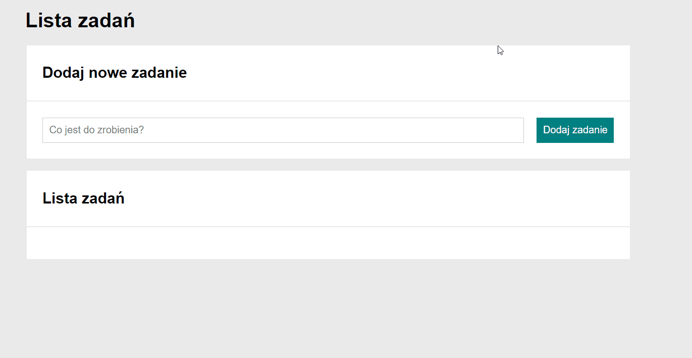

# To-Do List 2.0

**To-Do List 2.0** is a personal study project to create to-do list. Website allows to add new tasks, mark tasks as completed/not completed, hide completed tasks and remove tasks form the list.
Website has been reworked with immutable arrays.
## Demo
https://maciejkurpiecki.github.io/to-do-list2.0/

## Technologies
- HTML
- CSS 
- BEM
- Flex
- media queries
- JavaScript
- ES6
